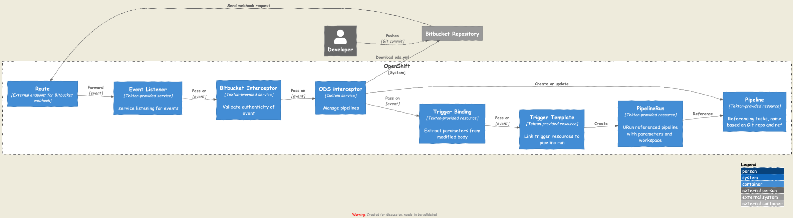

# ODS Pipeline Introduction

ODS provides CI/CD pipeline support based on OpenShift Pipelines. This introduction will walk you through the essentials, and guide you all the way to more advanced topics. Basic knowledge of Kubernetes concepts and OpenShift is assumed. Estimated reading time is about 15 minutes.

## What is OpenShift Pipelines?

https://www.openshift.com/learn/topics/pipelines[OpenShift Pipelines] is a Kubernetes-style CI/CD solution based on Tekton. It builds on the Tekton building blocks and offers tight integration with OpenShift. The main addition over plain Tekton is a UI in the OpenShift console.

## What is Tekton?

https://tekton.dev[Tekton] provides a framework to create cloud-native CI/CD pipelines. The two main components of Tekton are:

* **Tekton Pipelines** - this is the foundation of Tekton. It defines a set of Kubernetes Custom Resources that act as building blocks from which CI/CD pipelines can be assembled.

* **Tekton Triggers** - this allows to instantiate pipelines based on events. For example, one can trigger the execution of a pipeline every time a PR is merged against a GitHub repository.

We'll look at *Tekton Pipelines* in detail now, and will look at *Tekton Triggers* later on in this introduction.

A Tekton pipeline (a Kubernetes resource named `Pipeline`) references a series of tasks (a Kubernetes resource named `Task`). When the pipeline runs, Kubernetes will schedule one pod per task. Each task is made up of a series of steps. Each step corresponds to one container in the task pod. At a minimum, a step defines the container image to use, and which command / script to run. Therefore, a step can achieve a huge variety of things such as building artefacts, deploying, etc. Tekton distinguishes between the definition (`Pipeline` and `Task` resources) and the actual execution (also modelled as resources, namely `PipelineRun` and `TaskRun`). The `PipelineRun` provides a workspace to the pipeline, which is a Kubernetes volume mounted in the task pods. If the volume is a PVC, it can be shared between tasks, allowing the tasks to work e.g. on the same repository checkout. The following illustrates the basic Tekton architecture:

image::https://raw.githubusercontent.com/openshift/pipelines-tutorial/master/docs/images/tekton-architecture.svg[Tekton Architecture]

At this stage you know just enough about Tekton to continue with this introduction, but if you want to know more about it, you can read the https://tekton.dev/docs/[Tekton docs] and/or follow the https://github.com/openshift/pipelines-tutorial[OpenShift Pipelines tutorial].

## What does ODS bring to the table?

In regards to CI/CD, ODS provides two things:

* a few Tekton Tasks
* a webhook interceptor

We'll look at the Tekton tasks now and come back to the webhook interceptor later as it is connected to *Tekton Triggers*, the second main component of Tekton.

The ODS tasks can be used in a pipeline to build, deploy and test your application. Note that ODS does not implement it's own CI/CD system: The tasks provided by ODS are regular Tekton tasks and in fact you can use any Tekton task in a pipeline in addition to or instead of the tasks provided by ODS.

The tasks are so easy to exchange and compose as Tekton tasks have clearly defined inputs (the parameters), clearly defined outputs (the results) and work on a generic workspace, for which an actual volume is provided to them by the pipeline.

## Which tasks does ODS provide?

An ODS installation provides you with the following tasks, which are implemented as `ClusterTask` resources, allowing you to use them in any namespace:

* `ods-start`: Checkout repository and set Bitbucket build status
* `ods-build-go`: Build a Go application (includes Sonar scan)
* `ods-build-java`: Build a Java application (includes Sonar scan)
* `ods-build-python`: Build a Python application (includes Sonar scan)
* `ods-build-nodejs`: Build a TypeScript/JavaScript application (includes Sonar scan)
* `ods-build-image`: Package application into container image (includes Aqua scan)
* `ods-deploy-helm`: Deploy a Helm chart
* `ods-test-geb`: Run Geb/Spock tests
* `ods-test-cypress`: Run Cypress tests
* `ods-finish`: Set Bitbucket build status and upload artifacts to Nexus

Let's look at the `ods-build-*` tasks in more detail to understand what such tasks provide. The `ods-build-go` tasks consist of the following steps:

* Build Go binary (through running `go build`, `go test`, `golangci-lint run` etc.)
* Run static analysis of Go application against SonarQube

The other "language build tasks" like `ods-build-java` have the same steps, except that they make use of e.g. `gradle build` to build a JAR instead of a Go binary.

The `ods-build-image` tasks consist of the following steps:

* Build container image with Buildah
* Scan image with Trivy / Aqua
* Push container image to image stream

The produced images are tagged with the Git commit SHA being built. If the task detects this image tag to be already present in the image stream, all steps are skipped.

The behaviour of each task can be customized by setting parameters. For example, the `ods-build-image` tasks assumes the `Dockerfile` to be located in the `docker` directory by default. You can instruct the task to use a different Docker context by providing the `context-dir` parameter to the task.

## How do I use the tasks provided by ODS?

As you have learned earlier, tasks are referenced by pipelines. Therefore, all you would need to do to use the ODS tasks is to create a pipeline in OpenShift, and reference the tasks you want to execute. Then you'd need to start the pipeline (which creates a `PipelineRun`).

While using this approach is possible, it has a few drawbacks:

* You would need to create a pipeline for each repository (if they use different tasks or parameters)
* You would need to manage the pipelines in the UI
* You would need to start the pipeline manually after each commit

To solve these problems (and a few more that will become apparent later), ODS ships with another component alluded to earlier, the ODS webhook interceptor. Together with the functionality that *Tekton Triggers* provides out of the box, this interceptor allows to automate the creation, modification and execution of pipelines based on task definitions stored in the Git repository to which the pipeline corresponds.

To understand how this works, it is best to trace the flow starting from the repository. Assume you have a repository containing a Go application, and you want to run a pipeline building a container image for it every time you push to Bitbucket. To achieve this in a project created by ODS, all you need is to have an `ods.yml` file in the root of your repository. The `ods.yml` file defines the tasks you want to run in the pipeline. However, the tasks are not defined as one list, but rather associated with so called phases. ODS views pipelines as a sequence of six phases:

1. **Init** (e.g. checking out code, notifying systems of pipeline start)
2. **Build** (e.g. build artefact such as container image)
3. **Deploy** (e.g. deploy artefact)
4. **Test** (e.g. run tests against new deployment)
5. **Release** (e.g. release staged deployment and make it accessible to the public)
6. **Finalize** (e.g. creating reports, notifying systems of pipeline finish)

Those six phases do not provide logic on their own, instead they just serve as a structure for the pipeline. In fact, they are only a "container" for tasks, and may contain zero or more tasks. We'll come back to the reason for this concept of phases later on. For now, let's look at an example `ods.yml` file for our Go repository:

```yml
phases:

  build:

  - name: backend-build-go
    taskRef:
      kind: ClusterTask
      name: ods-build-go
    workspaces:
    - name: source
      workspace: shared-workspace

  - name: backend-build-image
    taskRef:
      kind: ClusterTask
      name: ods-build-image
    runAfter:
    - backend-build-go
    params:
    - name: image-stream
      value: backend
    workspaces:
    - name: source
      workspace: shared-workspace

  deploy:

  - name: backend-deploy
    taskRef:
      kind: ClusterTask
      name: ods-deploy-helm
    params:
    - name: release-name
      value: backend
    workspaces:
    - name: source
      workspace: shared-workspace
```

You can see that it defines three tasks: the `build` phase references the `ods-build-go` task and the `ods-build-image` task, and the deploy phase references the `ods-deploy-helm` task.

In a repository created through ODS quickstarter provisioning, you already have an `ods.yml` file with task definitions, and when a commit is pushed to Bitbucket, a pipeline reflecting those tasks will start automatically. However, any repository can gain this functionality by adding an `ods.yml` file and setting a webhook firing on every push in the Bitbucket repository.

The following will describe what happens once this webhook fires. A payload with information about the pushed Git commit is sent to a route connected to an event listener in OpenShift. The event listener is a small service provided by *Tekton Triggers*, running in your OpenShift namespace. However, before the payload arrives at the event listener, it is sent through interceptors. In the case of an ODS project, two interceptors are configured:

1. A Bitbucket interceptor. This interceptor is provided by *Tekton Triggers* and checks the authenticity of the request (did the request really originate from a push in the Bitbucket repository?)
2. A custom ODS interceptor.

This custom ODS interceptor is a small service, provided by ODS, and running in your OpenShift namespace. When it receives the request, it retrieves the `ods.yml` file from the Git repository/ref identified in the payload, and reads the phases configuration. Based on the tasks defined there, it assembles a new Tekton pipeline. The name of this new pipelines is a concatenation of the repository name and the Git ref (e.g. `myapp-master`). In the next step, the interceptor checks if a pipeline with that name already exists, and either creates a new pipeline or updates an existing pipeline. That way, you get one pipeline per branch which makes it easier to navigate in the OpenShift UI and allows to see pipeline duration trends easily. Finally, the interceptor adds the name of that pipeline to the webhook request payload, and the standard *Tekton Triggers* flow continues. This means that the amended request is forwarded to the event listener, which handles the event using a trigger binding and a trigger template. The trigger binding extracts values from the request payload to pass as parameters to the pipeline, and the trigger templates instantiates a pipeline run for the pipeline name passed from the ODS interceptor with the parameters provided by the trigger binding. The following illustrates this flow:



With the above in place, you do not need to manage pipelines manually. Every repository with an `ods.yml` file and a webhook configuration automatically manages and triggers pipelines based on the defined tasks.

At this stage you know just enough to get started using and modifying CI/CD pipelines with ODS. Read on for more complex scenarios (e.g. multi-repo pipelines) and some additional considerations.

TODO: Describe multi-repo pipelines (weaving tasks together based on referenced repositories and phases).
